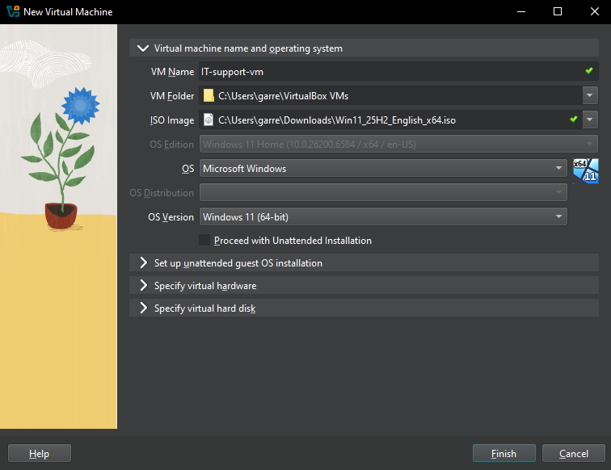
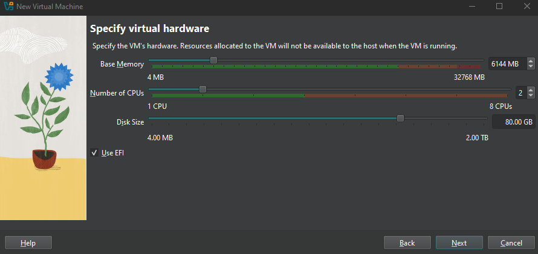
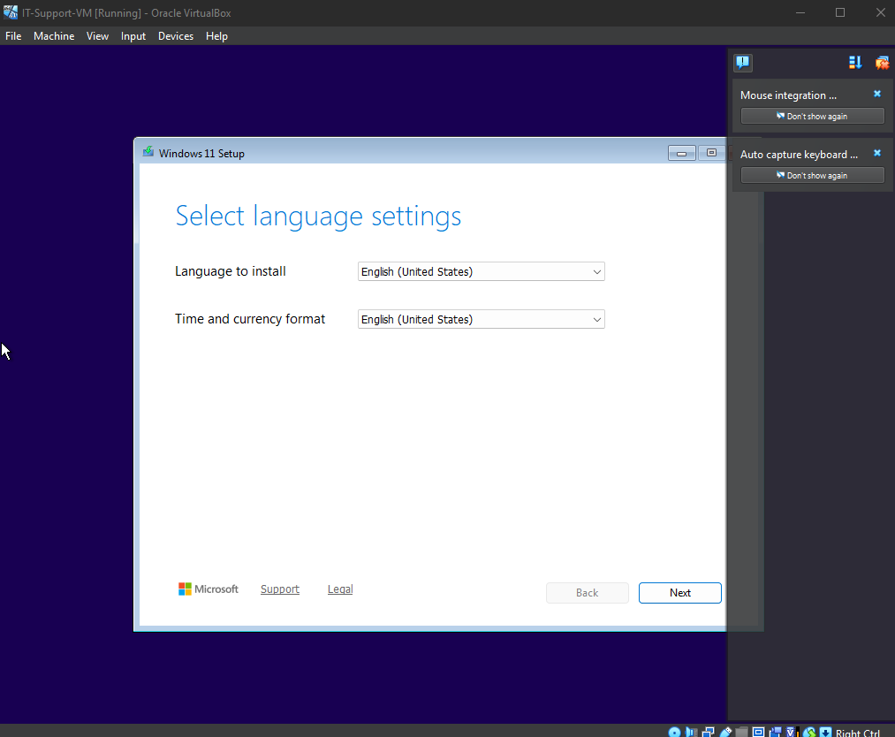

# 🖥️ Windows VM Installation (VirtualBox)

## Objective
Provision a Windows virtual machine in VirtualBox to serve as a lab environment for simulating real-world IT support scenarios.

---

## Environment
- **Platform:** Oracle VirtualBox  
- **Host System:** Windows  
- **Guest OS:** Windows 11 (64-bit ISO)

---

## VM Creation

### Initial Configuration
The virtual machine was created using the Windows 11 ISO through the VirtualBox setup wizard.

---

### Resource Allocation
The following resources were assigned to the virtual machine:

- **Memory (RAM):** 6 GB  
- **CPU:** 2 cores  
- **Storage:** 80 GB (VDI)

EFI was enabled to support Windows 11 installation requirements.

---

## Installation Setup
- Windows ISO attached as installation media  
- Default storage controller configuration used  
- VM configured to boot into the installation environment  

---

## Result
The virtual machine successfully booted into the Windows installation setup screen, confirming proper configuration.

---

## Key Takeaway
A properly provisioned virtual machine with adequate resources and correctly attached installation media provides a stable foundation for testing and troubleshooting real-world IT scenarios.

---

## Skills Demonstrated
- Virtual machine provisioning (VirtualBox)  
- Resource allocation and system configuration  
- OS installation setup  
- Environment preparation for IT support labs  
