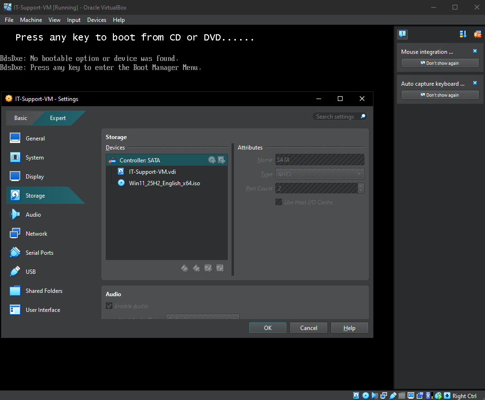
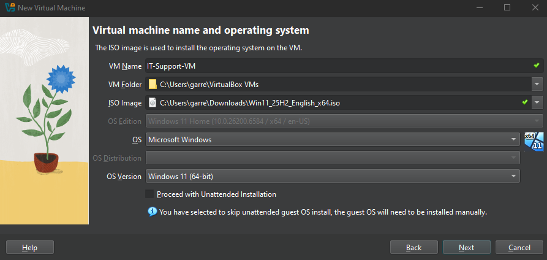
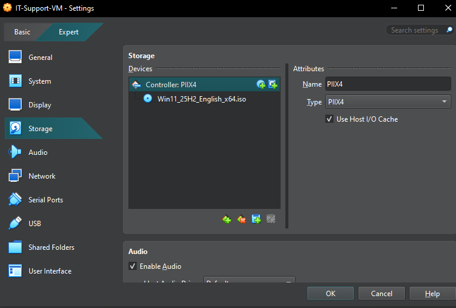
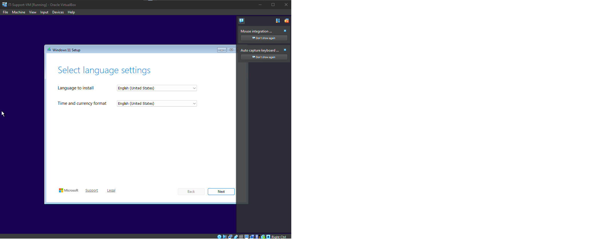

# 🖥️ Windows VM Installation (VirtualBox)

## Objective
Set up a Windows virtual machine to simulate real-world IT support scenarios.

---

## Configuration
- **OS:** Windows 10  
- **RAM:** 6 GB  
- **CPU:** 2 cores  
- **Storage:** 80 GB (VDI)

---

## Initial VM Configuration

---

## Issue
The virtual machine failed to boot after attaching the Windows ISO.

### Boot Error

---

## Troubleshooting Steps
1. Verified the Windows ISO was properly attached  
2. Checked VM boot order settings  
3. Reviewed storage controller configuration in VirtualBox  

---

## Root Cause
The Windows ISO was attached under an incorrect storage controller (SATA misconfiguration).

### Incorrect Configuration

---

## Resolution
- Powered off the virtual machine
- Reattached the ISO to the correct storage controller  
- Restarted the virtual machine  
- Verified proper boot sequence  

### Fixed Configuration

---

## Result
The virtual machine successfully booted into the Windows installation environment.

### Successful Boot

---

## Key Takeaway
Correct storage controller configuration is critical for VM boot operations. Misconfigured ISO attachments can prevent successful OS installation.
